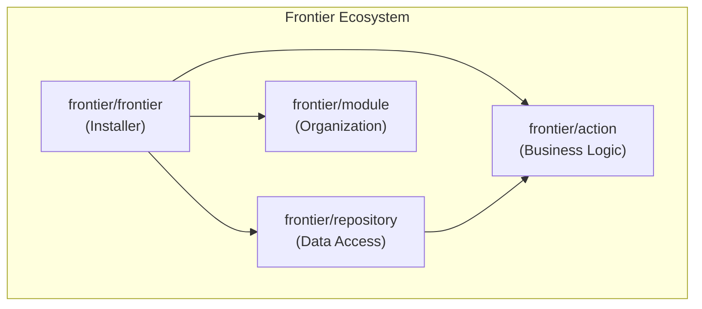

# Frontier

<p align="center">
  <strong>🚀 A Modular Laravel Starter Kit for Enterprise Applications</strong>
</p>

<p align="center">
  <a href="#installation">Installation</a> •
  <a href="#packages">Packages</a> •
  <a href="#quick-start">Quick Start</a> •
  <a href="#documentation">Documentation</a>
</p>

---

**Frontier** is a Laravel meta-package that bootstraps your application with battle-tested architectural patterns through an interactive CLI installer. Choose the components you need and get started with clean, maintainable code from day one.

## ✨ Key Features

| Feature | Description |
|---------|-------------|
| **Interactive Installer** | Beautiful CLI powered by Laravel Prompts |
| **Modular Design** | Install only what you need |
| **Best Practices Built-in** | Action, Repository, and Module patterns |
| **Laravel Native** | Full support for Laravel 10, 11, and 12 |
| **Artisan Generators** | Scaffold components with familiar commands |

---

## 📦 Packages

The Frontier ecosystem consists of four packages:

### Core Package

| Package | Description |
|---------|-------------|
| [`frontier/frontier`](#frontierfrontier) | Meta-package with interactive installer |

### Companion Packages

| Package | Description | Standalone |
|---------|-------------|:----------:|
| [`frontier/action`](#frontieraction) | Action pattern for business logic | ✅ |
| [`frontier/repository`](#frontierrepository) | Repository pattern for data access | ✅ |
| [`frontier/module`](#frontiermodule) | Modular application structure | ✅ |

---

## 🚀 Installation

### Full Installation (Recommended)

```bash
composer require frontier/frontier
php artisan frontier:install
```

The installer will guide you through selecting components:

```
🚀 Installing Frontier Starter Kit

Which components would you like to install?
  ◉ Actions - Action classes for business logic
  ◉ Repositories - Database abstraction layer
  ◉ Modules - Structure for using modules
```

### Individual Packages

Install packages separately based on your needs:

```bash
# Action Pattern only
composer require frontier/action

# Repository Pattern only
composer require frontier/repository

# Module System only
composer require frontier/module
```

---

## 📚 Quick Start

### Action Pattern

Encapsulate business logic in single-purpose classes:

```bash
php artisan frontier:action CreateUser
```

```php
<?php

namespace App\Actions;

use App\Models\User;
use Frontier\Actions\AbstractAction;

class CreateUserAction extends AbstractAction
{
    public function handle(array $data): User
    {
        return User::create([
            'name' => $data['name'],
            'email' => $data['email'],
            'password' => bcrypt($data['password']),
        ]);
    }
}
```

**Usage:**

```php
$user = CreateUserAction::exec($request->validated());
```

---

### Repository Pattern

Abstract data access with a clean interface:

```bash
php artisan frontier:repository UserRepository
```

```php
<?php

namespace App\Repositories;

use App\Models\User;
use Frontier\Repositories\RepositoryEloquent;

class UserRepository extends RepositoryEloquent
{
    public function __construct(User $model)
    {
        parent::__construct($model);
    }
}
```

**Usage:**

```php
// CRUD Operations
$user = $this->users->create(['name' => 'John']);
$user = $this->users->find(['id' => 1]);
$count = $this->users->update(['id' => 1], ['name' => 'Jane']);

// Advanced queries with pagination
$users = $this->users->retrievePaginate(['*'], [
    'filters' => ['is_active' => true],
    'sort' => 'created_at',
    'direction' => 'desc',
    'per_page' => 15,
]);
```

---

### Module System

Organize features into self-contained modules:

```bash
php artisan make:module user-management
composer update modules/user-management
```

**Structure:**

```
app-modules/
└── user-management/
    ├── src/
    │   ├── Models/
    │   ├── Http/Controllers/
    │   └── Providers/
    ├── routes/
    ├── resources/views/
    └── database/migrations/
```

**Generate components:**

```bash
php artisan make:controller UserController --module=user-management
php artisan make:model User --module=user-management
php artisan make:migration create_users_table --module=user-management
```

---

## 📖 Documentation

Detailed documentation for each package:

| Package | AI Guide | Description |
|---------|----------|-------------|
| Frontier | [00-FRONTIER_AI_GUIDE.md](docs/00-FRONTIER_AI_GUIDE.md) | Core installer and orchestration |
| Action | [01-ACTION_AI_GUIDE.md](docs/01-ACTION_AI_GUIDE.md) | Action pattern implementation |
| Repository | [02-REPOSITORY_AI_GUIDE.md](docs/02-REPOSITORY_AI_GUIDE.md) | Repository pattern with advanced queries |
| Module | [03-MODULE_AI_GUIDE.md](docs/03-MODULE_AI_GUIDE.md) | Modular application architecture |

---

## 🏗️ Architecture



### Pattern Overview

| Pattern | Package | Purpose |
|---------|---------|---------|
| Action | `frontier/action` | Single-purpose classes for business operations |
| Repository | `frontier/repository` | Abstract data access from business logic |
| Module | `frontier/module` | Organize code by domain/feature |

---

## 🎯 When to Use

### Use Frontier When:

- ✅ Starting a new Laravel project
- ✅ Building enterprise applications
- ✅ Working in a team environment
- ✅ Needing testable, maintainable architecture
- ✅ Planning for long-term scalability

### Package Selection Guide

| Scenario | Recommended Packages |
|----------|---------------------|
| Simple API | Action |
| CRUD Application | Action + Repository |
| Large Monolith | Action + Repository + Module |
| Microservice | Action + Repository |
| Domain-Driven Design | All three |

---

## 🔧 Requirements

- PHP >= 8.2
- Laravel 10.x, 11.x, or 12.x

---

## 📝 Artisan Commands

### Frontier Core

```bash
php artisan frontier:install                    # Interactive installer
```

### Action Package

```bash
php artisan frontier:action {name}              # Create action class
```

### Repository Package

```bash
php artisan frontier:repository {name}          # Create repository class
php artisan frontier:repository-action {name}   # Create repository action
```

### Module Package

```bash
php artisan make:module {name}                  # Create new module
php artisan modules:list                        # List all modules
php artisan modules:sync                        # Sync project config
php artisan make:* --module={name}              # Generate in module
```

---

## 🤝 Contributing

Contributions are welcome! Please follow these guidelines:

1. Follow PSR-12 coding standards
2. Use Laravel Pint for code styling
3. Write tests for new features
4. Update documentation as needed

---

## 📄 License

MIT License - see the [LICENSE](LICENSE) file for details.

---

## 👤 Author

**Mohamed Khedr**  
📧 [0xkhdr@gmail.com](mailto:0xkhdr@gmail.com)

---

<p align="center">
  Made with ❤️ for the Laravel community
</p>
