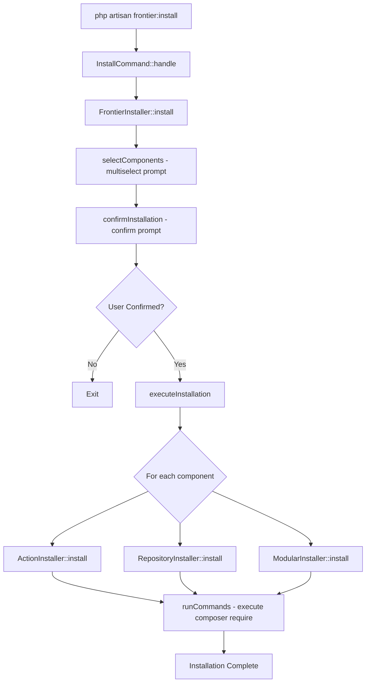

# Frontier Package - AI Guide

> **Laravel Starter Kit** - A modular installation package for bootstrapping Laravel applications with best practice patterns.

## Package Overview

**Frontier** is a Laravel package that provides an interactive CLI-based installer for setting up Laravel applications with commonly used architectural patterns. It serves as an orchestrator for installing modular sub-packages that implement specific design patterns.

### Key Features

- 🚀 **Interactive CLI Installation** - Uses Laravel Prompts for a beautiful, user-friendly installation experience
- 🧩 **Modular Architecture** - Choose only the components you need
- 📦 **Extensible Design** - Easy to add new component installers
- 🔧 **Laravel Integration** - Auto-discovered service provider, seamless composer integration

---

## Architecture

### Core Components

```
src/
├── Console/Commands/
│   └── InstallCommand.php         # Artisan command: frontier:install
├── Contracts/
│   └── Installer.php              # Installer interface contract
├── Enums/
│   └── Component.php              # Available component enum
├── Providers/
│   └── ServiceProvider.php        # Laravel service provider
├── Traits/
│   └── InteractsWithInstaller.php # Shared installer functionality
├── AbstractInstaller.php          # Base installer class
├── FrontierInstaller.php          # Main orchestrator
├── ActionInstaller.php            # Actions pattern installer
├── ModularInstaller.php           # Modules structure installer
└── RepositoryInstaller.php        # Repository pattern installer
```

### Design Patterns Used

| Pattern | Implementation |
|---------|----------------|
| **Template Method** | `AbstractInstaller` defines skeleton, sub-classes implement `install()` |
| **Strategy** | Different installer strategies selected via `match` expression |
| **Factory Method** | `make()` static method for instantiation |
| **Interface Segregation** | `Installer` contract with single responsibility |

---

## Related Packages

Frontier orchestrates the installation of these companion packages:

### 1. `frontier/action`
**Purpose**: Action classes for encapsulating business logic  
**Install**: `composer require frontier/action`

Actions provide a clean way to organize domain logic into single-purpose classes, keeping controllers thin and business logic testable.

### 2. `frontier/repository`
**Purpose**: Database abstraction layer using the Repository pattern  
**Install**: `composer require frontier/repository`

Repositories abstract database operations, providing a clean separation between your application logic and data access layer.

### 3. `frontier/module`
**Purpose**: Modular application structure  
**Install**: `composer require frontier/module`

Modules allow you to organize large applications into self-contained, feature-based modules with their own routes, controllers, models, and services.

---

## Installation & Usage

### Requirements

- PHP >= 8.2
- Laravel 10.x, 11.x, or 12.x

### Installation

```bash
composer require frontier/frontier
```

### Running the Installer

```bash
php artisan frontier:install
```

This will launch an interactive prompt where you can select which components to install:

1. **Actions** - Action classes for business logic
2. **Repositories** - Database abstraction layer using repositories  
3. **Modules** - Structure for using modules

---

## Code Flow

### Installation Flow Diagram



### Key Classes

#### `FrontierInstaller`
The main orchestrator that:
- Presents component selection menu via `multiselect()`
- Confirms user selection via `confirm()`
- Delegates to appropriate installer using `match` expression

#### `AbstractInstaller`
Base class providing:
- Constructor injection of Laravel Command instance
- Static factory method `make(Command $command)`
- Access to `InteractsWithInstaller` trait

#### `InteractsWithInstaller` Trait
Provides `runCommands()` method that:
- Executes shell commands via Symfony Process
- Streams output to console in real-time
- Runs from Laravel's base path

---

## Use Cases

### When to Use Frontier

✅ **Starting a new Laravel project** - Get best practices set up from day one  
✅ **Standardizing team architecture** - Ensure consistent patterns across projects  
✅ **Adopting new patterns** - Easy way to add Actions or Repositories to existing projects  
✅ **Building modular applications** - Set up module structure for large applications

### Example Scenarios

1. **API Backend**: Install Actions + Repositories for clean, testable business logic
2. **Large Monolith**: Install all three for maximum organization
3. **Microservice**: Install Modules to separate bounded contexts

---

## Extending Frontier

### Adding a New Component

1. Add to `Component` enum:
```php
enum Component: string
{
    case Action = 'Action';
    case Repository = 'Repository';
    case Modular = 'Modular';
    case NewComponent = 'NewComponent'; // Add here
}
```

2. Create installer class:
```php
class NewComponentInstaller extends AbstractInstaller
{
    protected array $commands = [
        'composer require frontier/new-component',
    ];

    public function install(): void
    {
        info('🚀 Installing Frontier NewComponent');
        $this->runCommands($this->commands);
        info('NewComponent installed successfully.');
    }
}
```

3. Add to `FrontierInstaller::$components` and `executeInstallation()` match expression.

---

## Technical Notes

### Dependencies

| Package | Purpose |
|---------|---------|
| `illuminate/support` | Laravel support utilities |
| `illuminate/console` | Artisan command infrastructure |
| `laravel/prompts` | Interactive CLI prompts (implied) |
| `symfony/process` | Shell command execution |

### Service Provider Auto-Discovery

The package is auto-discovered via `composer.json`:
```json
"extra": {
    "laravel": {
        "providers": [
            "Frontier\\Providers\\ServiceProvider"
        ]
    }
}
```

---

## File Reference

| File | Purpose | Key Methods |
|------|---------|-------------|
| [InstallCommand.php](file:///var/www/html/rai/up/frontier/src/Console/Commands/InstallCommand.php) | Artisan command entry point | `handle()` |
| [FrontierInstaller.php](file:///var/www/html/rai/up/frontier/src/FrontierInstaller.php) | Main installation orchestrator | `install()`, `selectComponents()`, `executeInstallation()` |
| [AbstractInstaller.php](file:///var/www/html/rai/up/frontier/src/AbstractInstaller.php) | Base installer class | `make()` |
| [ActionInstaller.php](file:///var/www/html/rai/up/frontier/src/ActionInstaller.php) | Actions component installer | `install()` |
| [RepositoryInstaller.php](file:///var/www/html/rai/up/frontier/src/RepositoryInstaller.php) | Repository pattern installer | `install()` |
| [ModularInstaller.php](file:///var/www/html/rai/up/frontier/src/ModularInstaller.php) | Modular structure installer | `install()` |
| [Installer.php](file:///var/www/html/rai/up/frontier/src/Contracts/Installer.php) | Installer contract | `install()` |
| [Component.php](file:///var/www/html/rai/up/frontier/src/Enums/Component.php) | Component enum | - |
| [InteractsWithInstaller.php](file:///var/www/html/rai/up/frontier/src/Traits/InteractsWithInstaller.php) | Command execution trait | `runCommands()` |
| [ServiceProvider.php](file:///var/www/html/rai/up/frontier/src/Providers/ServiceProvider.php) | Laravel service provider | `boot()` |

---

## Contributing

When contributing to this package:

1. Follow PSR-12 coding standards (laravel/pint is included)
2. Implement the `Installer` contract for new component installers
3. Extend `AbstractInstaller` for shared functionality
4. Use Laravel Prompts for any user interaction
5. Add new components to the `Component` enum

---

*Last updated: December 2024*
